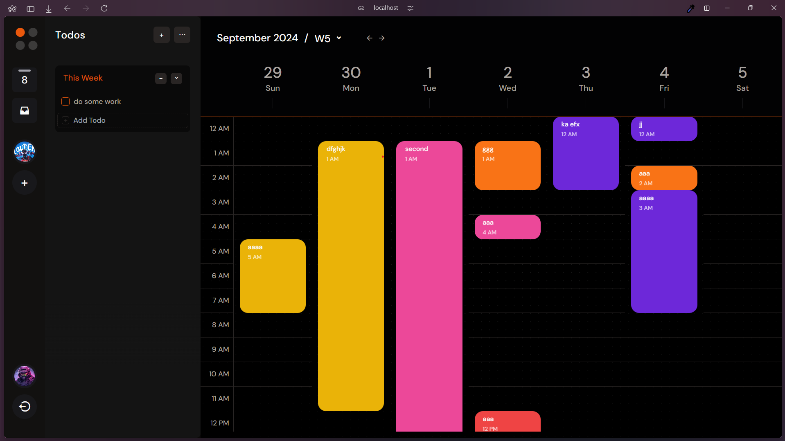

# Modern To-Do List Application



This is an advanced to-do list application featuring drag-and-drop functionality, calendar integration similar to Google Calendar, and powerful task management features. The application is built with a **frontend** and **backend** architecture, using Firebase for admin functionalities and Google Provider for user authentication.

## Features

- **Drag-and-Drop Interface**: Easily organize tasks with Dnd Kit.
- **Google Calendar-Like Integration**: Schedule tasks using an interactive calendar with daily, weekly, and monthly views.
- **Authentication**: Secure user sign-in with Google Provider.
- **Advanced Task Management**:
  - Recurring tasks
  - Task dependencies and priorities
  - Real-time updates
  - Custom views and filters
- **Admin Panel**: Admin functionalities powered by Firebase.

## Screenshots


## Tech Stack

**Frontend**:
- Vite
- React
- Dnd Kit (for drag-and-drop functionality)
- Axios (for API requests)
- Google Provider for authentication

**Backend**:
- Node.js
- Express
- Firebase Admin SDK (using `serviceAccount.json` for admin functionalities)
- MongoDB (optional, for storing additional user data)

## Installation

### Prerequisites
Make sure you have the following installed:
- [Node.js](https://nodejs.org/)
- [Firebase CLI](https://firebase.google.com/docs/cli)

### Clone the Repository
```bash
git clone https://github.com/Abshar777/modern-todoList.git
cd modern-todoList
```

### Installation

1. Clone the repository:

    ```bash
    git clone https://github.com/Abshar777/modern-todoList.git
    cd todo-list-app
    ```

2. Install dependencies:

    ```bash
    cd backend
    npm install
    npm start
    ```

3. Set up environment variables by creating a `.env` file in the root directory:

    ```bash
    PORT=port-number
    MONGO_URI=your-mongodb-uri
    JWT_SECRET=your-secrete-key
    ```

4. Start the development frontend:

    ```bash
    cd .\frontend\
    npm install
    npm run dev
    ```

5. Open the application in your browser:

    ```
    http://localhost:3000
    ```

### Google Authentication Setup

1. Go to the [Google Cloud Console](https://console.cloud.google.com/).
2. Create a new project and navigate to **APIs & Services > Credentials**.
3. Configure the OAuth 2.0 consent screen and create OAuth credentials.
4. Use the generated `Client ID` and `Client Secret` in the `.env` file.

## Usage

1. Sign in with Google to authenticate.
2. Create and manage tasks through the drag-and-drop interface.
3. Use the calendar to view and schedule tasks.
4. Customize your task views using filters and priorities.

## Technologies Used

- **Frontend**: React, Dnd Kit, Google Calendar API
- **Backend**: Node.js, Express
- **Database**: MongoDB
- **Authentication**: OAuth 2.0 (Google Provider)

## License

This project is licensed under the MIT License.

---

Happy organizing!


